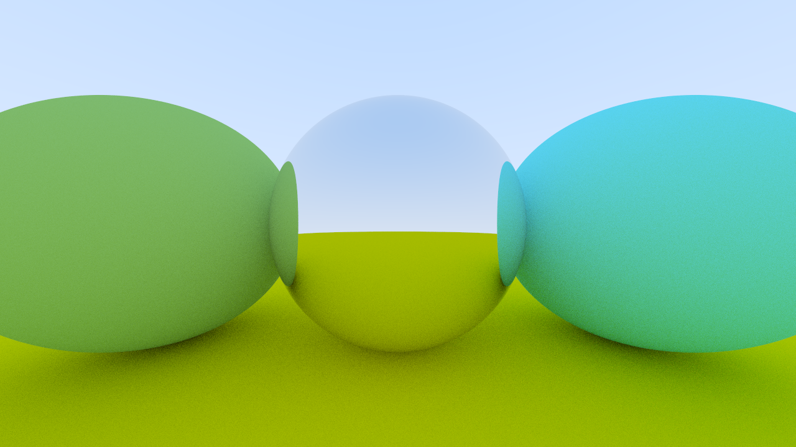

# python-raytracer
A simple ray tracing engine written in Python, based on the concepts and techniques from the book Ray Tracing in One Weekend by Peter Shirley.

## Features
- Ray-sphere intersection implementation
- Support for basic materials: Lambertian (diffuse) and metallic surfaces (with fuzz)
- Basic anti-aliasing using jittered supersampling
- Lightweight graphical user interface allowing the rendering of up to three spheres, with adjustable materials and RGB color settings

## Output Example


## Requirements
To run this project, you need Python standard libraries (usually pre-installed with Python ≥ 3.8). No external pip packages are required. Tested with Python 3.10+ on Windows and macOS. If you want to convert the output PPM image to PNG on Windows, make sure ImageMagick is installed and added to your system path.

## Additional info
All files are commented line by line in Italian, as the project was created for academic purposes and intended for a code presentation.

## Installation
```bash
git clone https://github.com/frapanico/python-raytracer.git
cd python-raytracer


